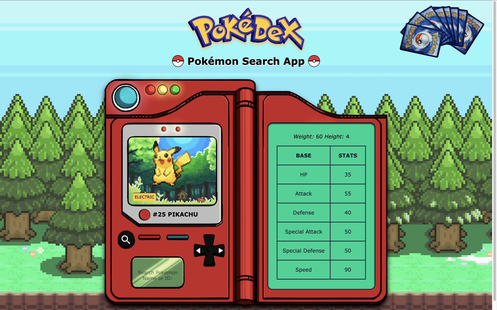
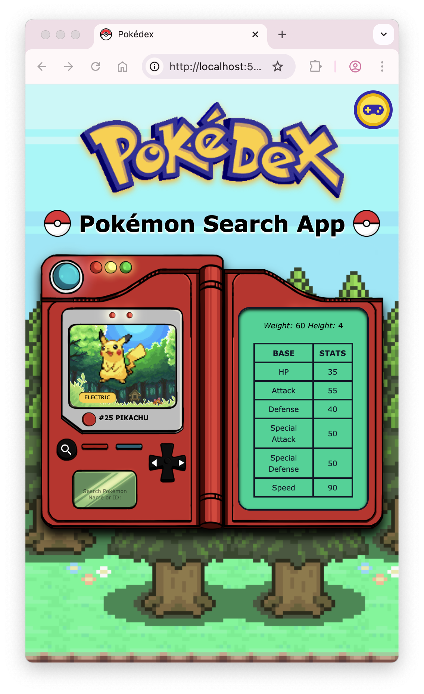
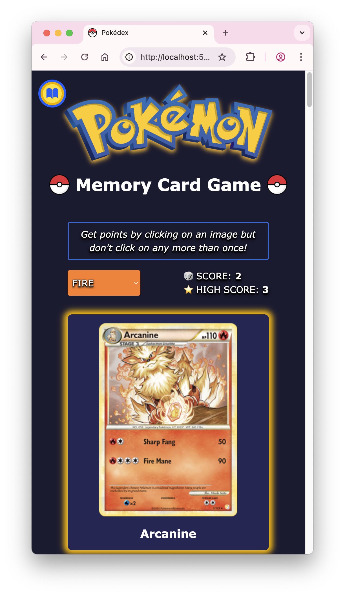
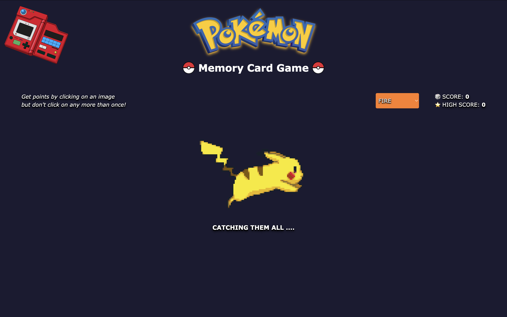
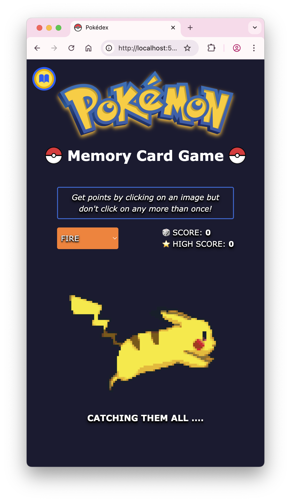

<div align="center" >
  

# <p align="center">Pokémon's Pokedex App with TCG Mega Cards</p>

A Fullstack Web App to browse Pokémon data from the PokéAPI and learn more about TCG Mega Cards from the Pokémon TCG API through a memory card game.
 


[](LICENSE)

</div>

---

## 🖼️ Live Demo

Frontend: [https://pokedex-633e.onrender.com](https://pokedex-633e.onrender.com)  
Backend API: [https://pokedex-backend-twtb.onrender.com/api/cards/fire](https://pokedex-backend-twtb.onrender.com/api/cards/fire)

---

## 🚀 Deployment Status

| Service     | Status                                                                                                                                      |
|-------------|---------------------------------------------------------------------------------------------------------------------------------------------|
| **Frontend** |  |
| **Backend**  |  |

---

## 🛠️ Tech Stack

| Frontend               | Backend                 |
| ---------------------- | ----------------------- |
|   |             |
|  |  **(Fetch API)** |
|  |  |
|  | |

### External APIs: [PokéAPI](https://pokeapi.co/) & [Pokémon TCG API](https://docs.pokemontcg.io/)

---

## ✨ Features

- **Browse Pokémon Data**  
  Fetch, search and display data (id, name, sprite, stats, types) for all Pokémon through the **PokéAPI**.

- **View & Interact with Pokémon Mega Cards**  
  Learn about popular Pokémon cards of different types fetched from the **Pokémon TCG API**, through a memory card game.

- **Responsive Design**  
  Fully responsive UI using **Tailwind CSS**, works on desktop & mobile.

- **Multi-Page Application**  
  Route handling on the frontend via **React Router**, to navigate seamlessly between the Home and Card Game pages.

- **Secure API Proxy**  
  API keys are **kept secret in the backend**, following best security practices.

- **Live Deployment on Render**  
  Easily deployable via Render with **HTTPS** out-of-the-box.

- **Monorepo Structure**  
  Manages frontend & backend in one repository for easier deployment and version control.

- **Fast Frontend with Vite**  
  Utilizes **Vite** for ultra-fast development & builds.

---

## 🔐 Why Use a Backend Proxy?

> **Pokémon TCG API Keys are secret and must not be exposed to the frontend.**

This app uses an **Express backend proxy** for:

- **Security**: Keep your API key secret and out of client-side code.
- **Rate Limiting**: Prevent client-side abuse that can lead to bans.
- **Simplified API Access**: Frontend makes a clean call to your own server.
- **CORS Handling**: Avoid CORS issues that might arise with direct API calls.

---

## 📁 Folder Structure

```
Pokedex/
├── backend/                 # Express server (API proxy with private API key handling)
│   ├── src/
│   │   └── server.ts        # API proxy endpoint
│   ├── package.json
│   └── .env                 # POKEMONTCG_API_KEY (local; set in Render for deployment)
│
├── frontend/                # React + Vite + Tailwind CSS app
│   ├── src/
│   │   |── assets/images         # All image assets
│   │   |── components/           # All TSX components
│   │   |── hooks/                # Custom hook to handle resizing
│   │   |── lib/      
│   │   |   └── types.ts          # Shared/global types
│   │   |── pages/                # React-Router pages made from TSX components
|   |   |   |── HomePage.tsx      # Landing page
|   |   |   └── CardGamePage.tsx  # Card Game page
│   │   |── utils/        
│   │   |   └── typeColors.ts     # Holds utility constants
│   │   └── App.tsx               # Main UI component
│   ├── package.json
│   └── .env                  # VITE_BACKEND_URL (set to backend URL)
│
├── README.md                 # Project documentation
```

---

## 🧪 API Reference

### Frontend 

| Method | Route                        |
| ------ | ---------------------------- |
| `GET`  | `/` (Landing Page)           |
| `GET`  | `/cardgame` (Card Game Page) |

### Backend 

| Method | Route        | Description                                           |
| ------ | ------------ | ----------------------------------------------------- |
| `GET`  | `/api/cards/:type` | Fetches Pokémon Mega cards based on type (default = "fire") from the Pokemon TCG API   |

---

## 📝 Example Response

### Backend: api/cards/fire 
> Pokémon TCG API cURL: [**https://api.pokemontcg.io/v2/cards?q=supertype:pokemon types:fire**](https://api.pokemontcg.io/v2/cards?q=supertype:pokemon%20types:fire)

```json
{
  "data": [
    {
      "id": "dp3-3",
      "name": "Charizard",
      "supertype": "Pokémon",
      "hp": "130",
      "types": [
        "Fire"
      ],
      "evolvesFrom": "Charmeleon",
      "abilities": [
        {
          "name": "Fury Blaze",
          "text": "If your opponent has 3 or less Prize cards left, each of Charizard's attacks does 50 more damage to the Active Pokémon (before applying Weakness and Resistance).",
          "type": "Poké-Body"
        }
      ],
      "attacks": [
        {
          "name": "Blast Burn",
          "cost": [
            "Fire",
            "Fire",
            "Fire",
            "Colorless"
          ],
          "convertedEnergyCost": 4,
          "damage": "120",
          "text": "Flip a coin. If heads, discard 2 Energy cards attached to Charizard. If tails, discard 4 Energy cards attached to Charizard. (If you can't, this attack does nothing.)"
        }
      ],
      "weaknesses": [
        {
          "type": "Water",
          "value": "+40"
        }
      ],
      "flavorText": "It is said that CHARIZARD's fire burns hotter if it has experienced harsh battles.",
      "nationalPokedexNumbers": [
        6
      ],
      "images": {
        "small": "https://images.pokemontcg.io/dp3/3.png",
        "large": "https://images.pokemontcg.io/dp3/3_hires.png"
      },
    },
    ....
  ]
}
```

### Frontend Fetch
> PokéAPI cURL: **https://pokeapi.co/api/v2/pokemon/pikachu**

```json
{
  "height": 4,
  "id": 25,
  "name": "pikachu",
  "sprites": {
    "front_default": "https://raw.githubusercontent.com/PokeAPI/sprites/master/sprites/pokemon/25.png",
    "other": {},
    "versions": {}
  },
  "stats": [
    {
      "base_stat": 35,
      "effort": 0,
      "stat": {
        "name": "hp",
        "url": "https://pokeapi.co/api/v2/stat/1/"
      }
    },
    {
      "base_stat": 55,
      "effort": 0,
      "stat": {
        "name": "attack",
        "url": "https://pokeapi.co/api/v2/stat/2/"
      }
    },
    {
      "base_stat": 40,
      "effort": 0,
      "stat": {
        "name": "defense",
        "url": "https://pokeapi.co/api/v2/stat/3/"
      }
    },
    {
      "base_stat": 50,
      "effort": 0,
      "stat": {
        "name": "special-attack",
        "url": "https://pokeapi.co/api/v2/stat/4/"
      }
    },
    {
      "base_stat": 50,
      "effort": 0,
      "stat": {
        "name": "special-defense",
        "url": "https://pokeapi.co/api/v2/stat/5/"
      }
    },
    {
      "base_stat": 90,
      "effort": 2,
      "stat": {
        "name": "speed",
        "url": "https://pokeapi.co/api/v2/stat/6/"
      }
    }
  ],
  "types": [
    {
      "slot": 1,
      "type": {
        "name": "electric",
        "url": "https://pokeapi.co/api/v2/type/13/"
      }
    }
  ],
  "weight": 60
}
```

---

## 🎨 UI Preview

|                    | Desktop                                                                        | Mobile                                                                        |
| ------------------ | ------------------------------------------------------------------------------ | ----------------------------------------------------------------------------- |
| **Home Page**      |  |  |
| **Card Game Page** |  |  |
| **Loading Screen** |   |   |

---

## 🙌 Contributing

PRs and forks are welcome!

---

## 📄 License

This project is licensed under the [MIT License](LICENSE).

---

## 🔗 Links

- PokéAPI: [https://pokeapi.co/](https://pokeapi.co/)
- Pokémon TCG API: [https://pokemontcg.io](https://pokemontcg.io)
- Render: [https://render.com](https://render.com)
- Tailwind CSS Docs: [https://tailwindcss.com/](https://tailwindcss.com/)
- Shields.io (badges): [https://shields.io](https://shields.io)

---

## ❓ Questions?

If you have any questions, feel free to [open an issue](https://github.com/AW-2021/Pokedex/issues) or [contact me](mailto:aminawasif20@gmail.com)!
