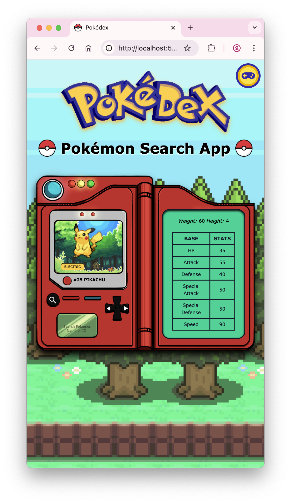

<div align="center" >
  

# <p align="center">Pokémon's Pokedex App with TCG Mega Cards</p>

A Fullstack Web App to browse Pokémon data from the PokéAPI and learn more about TCG Mega Cards from the Pokémon TCG API through a memory card game.
 


[](LICENSE)

</div>

---

## 🖼️ Live Demo

Frontend: [https://your-frontend-service.onrender.com](https://your-frontend-service.onrender.com)  
Backend API: [https://your-backend-service.onrender.com/api/cards](https://your-backend-service.onrender.com/api/cards)

---

## 🚀 Deployment Status

| Service     | Status                                                                                                                                      |
|-------------|---------------------------------------------------------------------------------------------------------------------------------------------|
| **Frontend** |  |
| **Backend**  |  |

---

## 🛠️ Tech Stack

| Frontend         | Backend                 |
| ---------------- | ----------------------- |
| **React (Vite)** | **Express**             |
| **Tailwind CSS** | **Node.js (Fetch API)** |
| **TypeScript**   | **TypeScript**          |

### External APIs: [PokéAPI](https://pokeapi.co/) and [Pokémon TCG API](https://docs.pokemontcg.io/)

---

## ✨ Features

- **Browse Pokémon Data**  
  Fetch, search and display data (id, name, sprite, stats, types) for all Pokémon through the **PokéAPI**.

- **View & Interact with Pokémon Mega Cards**  
  Learn about popular Pokémon cards (of Fire type) fetched from the **Pokémon TCG API**, through a memory card game.

- **Responsive Design**  
  Fully responsive UI using **Tailwind CSS**, works on desktop & mobile.

- **Multi-Page Application**  
  Route handling on the frontend via **React Router**, to navigate seamlessly between the Home and Card Game pages.

- **Secure API Proxy**  
  API keys are **kept secret in the backend**, following best security practices.

- **Live Deployment on Render**  
  Easily deployable via Render with **HTTPS** out-of-the-box.

- **Monorepo Structure**  
  Manage frontend & backend in one repository for easier deployment and version control.

- **Fast Frontend with Vite**  
  Utilizes **Vite** for ultra-fast development & builds.

---

## 🔐 Why Use a Backend Proxy?

> **Pokémon TCG API Keys are secret and must not be exposed to the frontend.**

This app uses an **Express backend proxy** for:

- **Security**: Keep your API key secret and out of client-side code.
- **Rate Limiting**: Prevent client-side abuse that can lead to bans.
- **Simplified API Access**: Frontend makes a clean call to your own server.
- **CORS Handling**: Avoid CORS issues that might arise with direct API calls.

---

## 📁 Folder Structure

```
Pokedex/
├── backend/               # Express server (API proxy with private API key handling)
│   ├── src/
│   │   └── server.ts      # API proxy endpoint
│   ├── package.json
│   └── .env               # POKEMONTCG_API_KEY (local; set in Render for deployment)
│
├── frontend/              # React + Vite + Tailwind CSS app
│   ├── src/
│   │   |── assets/images      # All image assets
│   │   |── components/        # All TSX components
│   │   |── hooks/             # Custom hook to handle resizing
│   │   |── lib/      
│   │   |   └── types.ts       # Shared/global types
│   │   |── pages/             # React-Router pages made from TSX components
│   │   |── utils/        
│   │   |   └── typeColors.ts  # Holds utility constants
│   │   └── App.tsx            # Main UI component
│   ├── package.json
│   └── .env               # VITE_BACKEND_URL (set to backend URL)
│
├── README.md              # Project documentation
```

---

## 🧪 API Reference

### Frontend 

| Method | Route                        |
| ------ | ---------------------------- |
| `GET`  | `/` (Landing Page)           |
| `GET`  | `/cardgame` (Card Game Page) |

### Backend 

| Method | Route        | Description                                           |
| ------ | ------------ | ----------------------------------------------------- |
| `GET`  | `/api/cards` | Fetches Pokémon Mega cards from the Pokemon TCG API   |

---

## 📝 Example Response

```json
{
  "data": [
    {
      "id": "dp3-3",
      "name": "Charizard",
      "supertype": "Pokémon",
      "level": "55",
      "hp": "130",
      "types": [
        "Fire"
      ],
      "evolvesFrom": "Charmeleon",
      "abilities": [
        {
          "name": "Fury Blaze",
          "text": "If your opponent has 3 or less Prize cards left, each of Charizard's attacks does 50 more damage to the Active Pokémon (before applying Weakness and Resistance).",
          "type": "Poké-Body"
        }
      ],
      "attacks": [
        {
          "name": "Blast Burn",
          "cost": [
            "Fire",
            "Fire",
            "Fire",
            "Colorless"
          ],
          "convertedEnergyCost": 4,
          "damage": "120",
          "text": "Flip a coin. If heads, discard 2 Energy cards attached to Charizard. If tails, discard 4 Energy cards attached to Charizard. (If you can't, this attack does nothing.)"
        }
      ],
      "weaknesses": [
        {
          "type": "Water",
          "value": "+40"
        }
      ],
      "number": "3",
      "artist": "Daisuke Ito",
      "rarity": "Rare Holo",
      "flavorText": "It is said that CHARIZARD's fire burns hotter if it has experienced harsh battles.",
      "nationalPokedexNumbers": [
        6
      ],
      "images": {
        "small": "https://images.pokemontcg.io/dp3/3.png",
        "large": "https://images.pokemontcg.io/dp3/3_hires.png"
      },
    }
  ]
}
```

---

## 🎨 UI Preview

|                    | Desktop                                                                        | Mobile                                                                        |
| ------------------ | ------------------------------------------------------------------------------ | ----------------------------------------------------------------------------- |
| **Home Page**      |  |  |
| **Card Game Page** |  |  |
| **Loading Screen** |   |   |

---

## 🙌 Contributing

PRs and forks are welcome!

---

## 📄 License

This project is licensed under the [MIT License](LICENSE).

---

## 🔗 Links

- PokéAPI: [https://pokeapi.co/](https://pokeapi.co/)
- Pokémon TCG API: [https://pokemontcg.io](https://pokemontcg.io)
- Render: [https://render.com](https://render.com)
- Tailwind CSS Docs: [https://tailwindcss.com/](https://tailwindcss.com/)
- Shields.io (badges): [https://shields.io](https://shields.io)

---

## ❓ Questions?

If you have any questions, feel free to [open an issue](https://github.com/AW-2021/Pokedex/issues) or [contact me](mailto:aminawasif20@gmail.com)!
